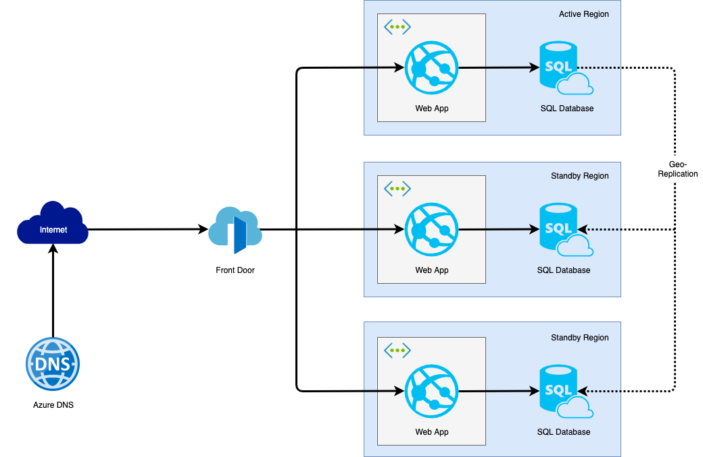

# Azure Data Engineer - Week 2 - SQL - Homework

Below is the architecure diagram for an web application hosted in Azure with a requirement that is should use any relational database (with minimum two read-replicas) 

Key decisions taken and explanation:
- Selected database servide is Azure SQL. This service is very flexible when it comes to scaling, so in the beginning it can use very simple DTU model and scale up depending on traffic. After observing some key metrics available in Azure Monitor, depending on application traffic, it can scale up in the same model or switch to serverless or to vCore model with dedicated resources. This change can be performed almost online, without dataloss or need to perform data migration.
- There is one active region and two standy-regions with geo-replication mechanism used.
- Application is hosted on Web App service (within own App Service Plan) with VNet integration enabled. Outgoing traffic from the application to database is coming with source IP addresses from private VNet.
- Database has firewall enabled and "Allow Azure Sevices" disabled. Enabling this option will allow whole Azure subnets (any service, subscription or tenant). Only dedicated VNet is allowed to connect to SQL instance.
- Azure Front Door is used to redirect traffic from Internet to active region. All 3 regions are configured as backend pool and appropriate healthchecks are set up to allow run in active-standby mode.
- Azure DNS is used for DNS lookup, because application is using own custom DNS domain.

