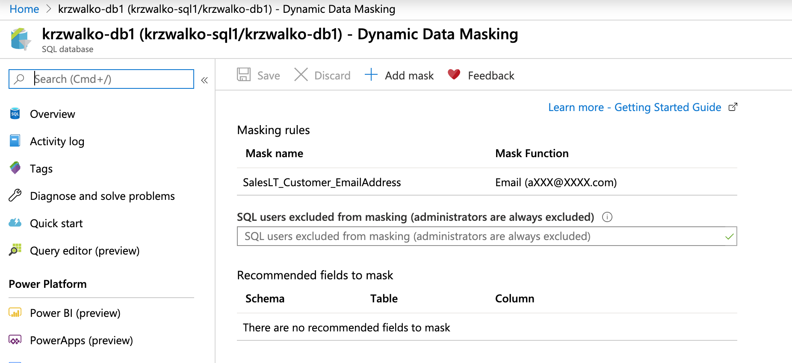

# Azure Data Engineer - Week 2 - SQL - Homework

Complete AZ CLI script is here: [homework2.azcli](homework2.azcli). You need also *.sql files to properly execute queries. Prerequisite: `tsql` command from FreeTDS package.

## 1. Azure SQL Database in westeurope replicated to northeurope

Create a database replica:

```sh
$ az sql db replica create -s krzwalko-sql1 -n krzwalko-db1 --partner-server krzwalko-sql2
```

View in AZ CLI:
```sh
$ az sql db replica list-links -s krzwalko-sql1 -n krzwalko-db1 -ojson
```

```json
[
  {
    "id": "/subscriptions/xxxxxxxx-xxxx-49a4-90a3-8bd80d364023/resourceGroups/krzwalko-dev/providers/Microsoft.Sql/servers/krzwalko-sql1/databases/krzwalko-db1/replicationLinks/2fb38c93-36f5-488f-9a32-4de4910b4cf8",
    "isTerminationAllowed": true,
    "location": "West Europe",
    "name": "2fb38c93-36f5-488f-9a32-4de4910b4cf8",
    "partnerDatabase": "krzwalko-db1",
    "partnerLocation": "North Europe",
    "partnerRole": "Secondary",
    "partnerServer": "krzwalko-sql2",
    "percentComplete": 100,
    "replicationMode": "ASYNC",
    "replicationState": "CATCH_UP",
    "resourceGroup": "krzwalko-dev",
    "role": "Primary",
    "startTime": "2020-02-01T20:58:57.523000",
    "type": "Microsoft.Sql/servers/databases/replicationLinks"
  }
]
```


View in Portal:


## 2. Update automatic tuning by setting create_index to on

Configure automatic tuning:
```sh
$ cat homework2-tuning-create-index.sql ALTER DATABASE current SET AUTOMATIC_TUNING (FORCE_LAST_GOOD_PLAN = DEFAULT, CREATE_INDEX = ON, DROP_INDEX = DEFAULT);
GO

$ tsql -S krzwalko-sql1.database.windows.net -D krzwalko-db1 -U $USERNAME -P $PASSWORD < homework2-tuning-create-index.sql
locale is "en_US.UTF-8"
locale charset is "UTF-8"
using default charset "UTF-8"
Setting krzwalko-db1 as default database in login packet
```


Check automatic tuning option via T-SQL:

```sh
cat homework2-tuning-check.sql
SELECT * FROM sys.database_automatic_tuning_options;
go

$ tsql -S krzwalko-sql1.database.windows.net -D krzwalko-db1 -U $USERNAME -P $PASSWORD < homework2-tuning-check.sql
locale is "en_US.UTF-8"
locale charset is "UTF-8"
using default charset "UTF-8"
Setting krzwalko-db1 as default database in login packet
1> 2> name      desired_state   desired_state_desc      actual_state    actual_state_desc       reason  reason_desc
FORCE_LAST_GOOD_PLAN    2       DEFAULT 1       ON      3       INHERITED_FROM_SERVER
CREATE_INDEX    1       ON      1       ON      NULL    NULL
DROP_INDEX      2       DEFAULT 0       OFF     3       INHERITED_FROM_SERVER
MAINTAIN_INDEX  2       DEFAULT 0       OFF     3       INHERITED_FROM_SERVER
(4 rows affected)
```


View in portal:


Reference for automatic tuning management using T-SQL: https://azure.microsoft.com/en-gb/blog/automatic-tuning-introduces-automatic-plan-correction-and-t-sql-management/

## 3. Data masking configuration

```
$ cat homework2-create-datamask.sql 
ALTER TABLE [SalesLT].[Customer] ALTER COLUMN [EmailAddress] ADD MASKED WITH (FUNCTION = 'email()');
GO

$ tsql -S krzwalko-sql1.database.windows.net -D krzwalko-db1 -U $USERNAME -P $PASSWORD < homework2-create-datamask.sql
locale is "en_US.UTF-8"
locale charset is "UTF-8"
using default charset "UTF-8"
Setting krzwalko-db1 as default database in login packet
```

Display data masking in Portal:



Reference for Dynamic Data Masking in T-SQL: https://docs.microsoft.com/en-us/sql/relational-databases/security/dynamic-data-masking?view=sql-server-ver15


## 4. Data masking check

Create user and add to db_datareader role:

```
$ cat homework2-create-user.sql 
CREATE USER test WITH PASSWORD='SuperCloud!'
EXEC sp_addrolemember 'db_datareader', 'test';
GO

$ tsql -S krzwalko-sql1.database.windows.net -D krzwalko-db1 -U $USERNAME -P $PASSWORD < homework2-create-user.sql
locale is "en_US.UTF-8"
locale charset is "UTF-8"
using default charset "UTF-8"
Setting krzwalko-db1 as default database in login packet
1> 2> 3> (return status = 0)
```

Select masked data from table:

```
$ tsql -S krzwalko-sql1.database.windows.net -D krzwalko-db1 -U test -P 'SuperCloud!' < homework2-select.sql
locale is "en_US.UTF-8"
locale charset is "UTF-8"
using default charset "UTF-8"
Setting krzwalko-db1 as default database in login packet
1> 2> CustomerId        EmailAddress
202     aXXX@XXXX.com
29943   aXXX@XXXX.com
345     aXXX@XXXX.com
29792   aXXX@XXXX.com
511     aXXX@XXXX.com
30052   aXXX@XXXX.com
75      aXXX@XXXX.com
29702   aXXX@XXXX.com
659     aXXX@XXXX.com
29978   aXXX@XXXX.com
(10 rows affected)
```

