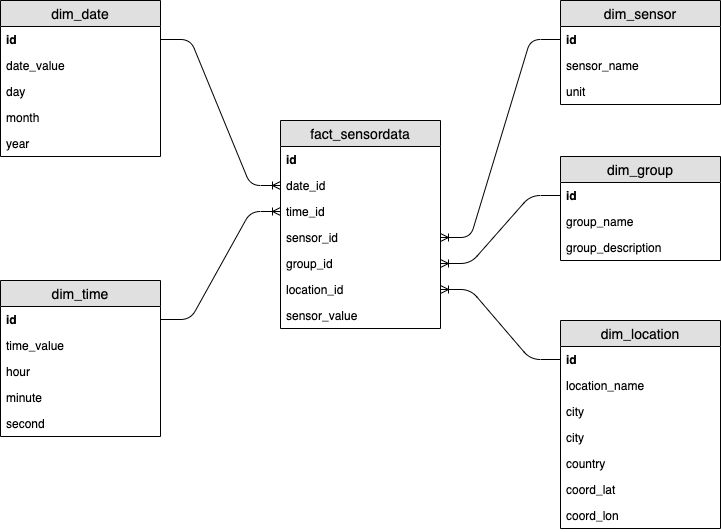

# Task 1 - design star schema for data warehouse

### Domain: IoT application for tracking

Assumptions for application:
- Application tracks sensor data from various type of sensors (temperature, humidity, pressure, etc...) in various units (ie: °C, °F, hPa, etc...).
- It stores data for different locations (identified by name, city, country and geocoordinates).
- Sensors are grouped together by groups identified by name and description.

There are one fact table in this data mart:

fact_sensordata
- id
- date_id
- time_id
- sensor_id
- group_id
- location_id
- sensor_value

Few dimension tables:

dim_date
- id
- date_value
- day
- month
- year

dim_time
- id
- time_value
- hour
- minute
- second

dim_sensor
- id
- sensor_name
- unit

dim_group
- id
- group_name
- group_description

dim_location
- id
- location_name
- city
- country
- coord_lat
- coord_lon

Below is diagram for designed star-schema:



### Example query for getting data

Select average temperature for all locations in Katowice, Poland for each group and hour in the day during January 2020

```
SELECT
    g.group_name AS group_name,
    t.hour AS hour,
    AVG(f.sensor_value) AS avg_temp
FROM fact_sensordata f
INNER JOIN dim_sensor s ON f.sensor_id = s.id
INNER JOIN dim_group g ON f.group_id = g.id
INNER JOIN dim_date d ON f.date_id = d.id
INNER JOIN dim_time t ON f.time_id = t.id
INNER JOIN dim_location l ON f.location_id = l.id
WHERE
    s.sensor_name = 'temperature' AND
    l.city = 'Katowice' AND
    l.country = 'Poland' AND
    d.month = 1 AND
    d.year = 2020
GROUP BY
    g.group_name, 
    t.hour
```
